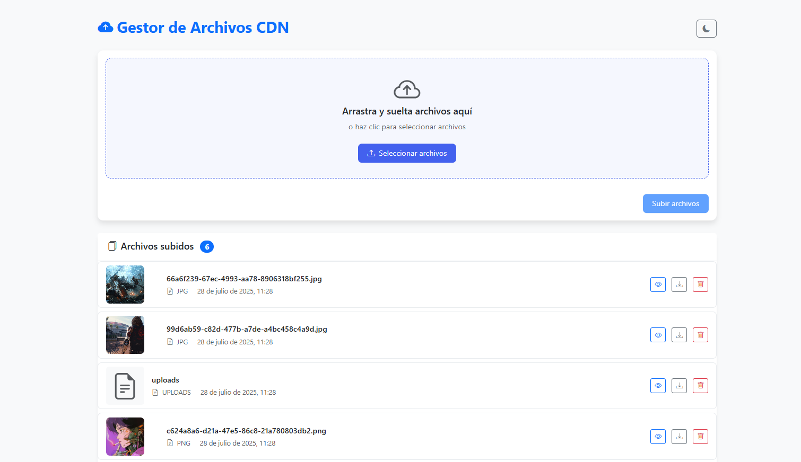

# Mandaditos CDN

<p align="center">
  
</p>

A simple CDN file manager built with Flask that allows uploading, viewing, and serving static files with automatic thumbnail generation for images.

## Features

- ✨ **File Upload**: Supports multiple image formats (PNG, JPG, JPEG, GIF, SVG, WebP)
- 🖼️ **Automatic Thumbnail Generation**: Creates 150x150px thumbnails for raster images
- 📁 **File Management**: Web interface to view and delete files
- 🚀 **CDN Service**: Dedicated endpoints to serve files and thumbnails
- 🐳 **Dockerized**: Includes Docker configuration with Nginx as reverse proxy
- 🔒 **File Validation**: Only allows specific image formats

## Project Structure

```
mandaditos-cdn/
├── app.py              # Main Flask application
├── requirements.txt    # Python dependencies
├── Dockerfile          # Docker configuration
├── nginx.conf          # Nginx configuration
├── templates/
│   └── index.html      # Main web interface
├── static/
│   └── style.css       # CSS styles
└── uploads/            # Uploaded files directory
    └── thumbnails/     # Generated thumbnails
```

## Installation and Usage

### Option 1: Local Execution

1. **Clone the repository**:
   ```bash
   git clone <repository-url>
   cd mandaditos-cdn
   ```

2. **Create virtual environment**:
   ```bash
   python -m venv venv
   source venv/bin/activate  # On Linux/Mac
   # or
   venv\Scripts\activate     # On Windows
   ```

3. **Install dependencies**:
   ```bash
   pip install -r requirements.txt
   ```

4. **Run the application**:
   ```bash
   python app.py
   ```

5. **Access the application**:
   Open your browser at `http://localhost:5000`

### Option 2: Docker

1. **Build the image**:
   ```bash
   docker build -t mandaditos-cdn .
   ```

2. **Run the container**:
   ```bash
   docker run -p 8000:8000 -v $(pwd)/uploads:/app/uploads mandaditos-cdn
   ```

3. **Access the application**:
   Open your browser at `http://localhost:8000`

### Option 3: Docker Compose (with Nginx)

For a more robust deployment with Nginx as reverse proxy, you can create a `docker-compose.yml`:

```yaml
version: '3.8'
services:
  app:
    build: .
    ports:
      - "8000:8000"
    volumes:
      - ./uploads:/app/uploads
  
  nginx:
    image: nginx:alpine
    ports:
      - "80:80"
    volumes:
      - ./nginx.conf:/etc/nginx/nginx.conf
    depends_on:
      - app
```

## API Endpoints

### Web Interface
- `GET /` - Main page with file list

### File Management
- `POST /upload` - Upload a new file
- `POST /delete/<filename>` - Delete a file

### CDN Endpoints
- `GET /cdn/<filename>` - Serve original file
- `GET /cdn/thumbnails/<filename>` - Serve file thumbnail

## Supported Formats

## Supported Formats

- **PNG** (.png)
- **JPEG** (.jpg, .jpeg)
- **GIF** (.gif)
- **SVG** (.svg)
- **WebP** (.webp)

## Configuration

### Environment Variables (Optional)

- `UPLOAD_FOLDER`: Directory for uploaded files (default: 'uploads')
- `THUMBNAIL_FOLDER`: Directory for thumbnails (default: 'uploads/thumbnails')
- `THUMBNAIL_SIZE`: Thumbnail size in pixels (default: 150x150)

### Customization

You can modify the following constants in `app.py`:

```python
UPLOAD_FOLDER = 'uploads'
THUMBNAIL_FOLDER = 'uploads/thumbnails'
ALLOWED_EXTENSIONS = {'png', 'jpg', 'jpeg', 'gif', 'svg', 'webp'}
THUMBNAIL_SIZE = (150, 150)
```

## Technologies Used

- **Backend**: Flask 3.0.3
- **WSGI Server**: Gunicorn 23.0.0
- **Image Processing**: Pillow 10.4.0
- **Reverse Proxy**: Nginx (optional)
- **Frontend**: Bootstrap 5.3.3
- **Containerization**: Docker

## Development

### Application Structure

- `app.py`: Contains all Flask application logic
- `templates/index.html`: User interface with Bootstrap
- `nginx.conf`: Nginx configuration for production
- `Dockerfile`: Configuration for containerization
- `test_app.py`: Unit and integration test suite
- `.github/workflows/`: CI/CD automation with GitHub Actions

### Main Functions

- `allowed_file()`: Validates allowed file extensions
- `create_thumbnail()`: Generates thumbnails automatically
- `upload_file()`: Handles file uploads
- `delete_file()`: Deletes files and their thumbnails
- `serve_file()` and `serve_thumbnail()`: Serve static files

### CI/CD Pipeline

The project includes automated testing and release workflows:

**GitHub Actions Workflows:**
- 🧪 **Automated Testing**: Runs on every push and pull request
- 🚀 **Automatic Releases**: Creates releases when tests pass on main branch
- 🐳 **Docker Integration**: Builds and tests Docker images
- 📊 **Code Quality**: Linting and security checks
- 🔧 **Environment Support**: Configurable upload and thumbnail directories

**Workflow Triggers:**
- Tests run on all branches for pull requests
- Releases are created only on pushes to `main` branch
- Version numbers auto-increment (patch by default)
- Environment variables: `UPLOAD_FOLDER`, `THUMBNAIL_FOLDER`

### Running Tests

The project includes a complete unit and integration test suite:

```bash
# Using unittest (built-in)
python test_app.py

# Using pytest (recommended)
pip install pytest pytest-cov
pytest test_app.py -v

# With coverage report
pytest test_app.py --cov=app --cov-report=html
```

**Test Coverage**:
- ✅ File upload (valid and invalid formats)
- ✅ Thumbnail generation
- ✅ File and thumbnail serving
- ✅ File deletion
- ✅ Helper function validation
- ✅ Complete integration flow
- ✅ Error handling and edge cases

## Security

- ✅ File type validation
- ✅ Unique file names (UUID)
- ✅ File path sanitization
- ⚠️ **Note**: This application is designed for internal use. For production, consider implementing:
  - Authentication and authorization
  - File size limits
  - Rate limiting
  - HTTPS

## Contributing

1. Fork the project
2. Create a feature branch (`git checkout -b feature/new-feature`)
3. Commit your changes (`git commit -am 'Add new feature'`)
4. Push to the branch (`git push origin feature/new-feature`)
5. Create a Pull Request

## License

This project is under the MIT License. See the LICENSE file for more details.

## Support

If you find any issues or have suggestions, please create an issue in the repository.
